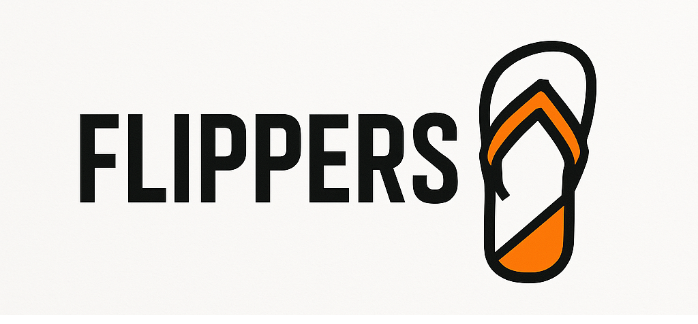
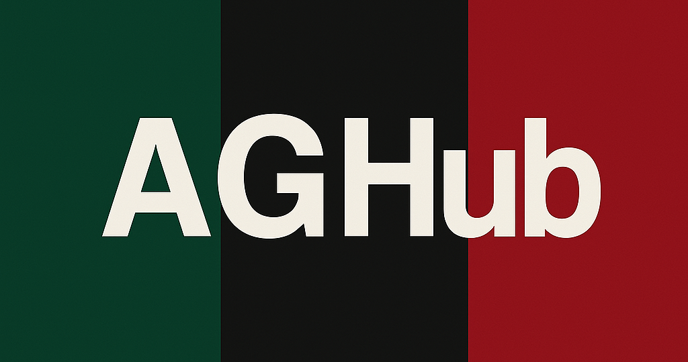

# IO_Hackathon
AGH IO 2025 Hackathon, Piotr Błaszczyk, Stanisław Barycki, Krzysztof Swędzioł, Joachim Grys, Eryk Olejarz, Piotr Rusak  
## Nazwa zespołu ##  
# Flippers   

## Nazwa aplikacji   
# AGHub    

# WIZJA PROJEKTU

## 1. Wstęp  

Dynamiczny charakter współczesnego życia studenckiego powoduje, że studenci często mają trudności ze zgraniem swoich harmonogramów, efektywnym planowaniem spotkań czy po prostu spędzaniem wspólnie czasu. Poszczególne wydziały oraz kierunki studiów często funkcjonują według różnych planów zajęć, co znacznie utrudnia organizację zarówno spotkań towarzyskich, jak i pracy grupowej.

Nasza aplikacja odpowiada na te problemy, dostarczając studentom scentralizowaną i intuicyjną platformę do łatwego planowania wydarzeń, koordynowania dostępności znajomych oraz sprawdzania ich planów zajęć w czasie rzeczywistym. Dzięki aplikacji użytkownicy mogą szybko zobaczyć, kiedy i gdzie ich znajomi mają zajęcia lub inne zobowiązania, co znacząco upraszcza organizowanie zarówno formalnych, jak i nieformalnych spotkań.

Rozwiązanie zostało stworzone z myślą o elastyczności i specyfice życia studenckiego, wspierając zarówno zaplanowane spotkania projektowe, jak i spontaniczne wydarzenia towarzyskie. Dzięki dostępowi przez przeglądarkę oraz urządzenia mobilne (systemy Adnroid oraz iOS), aplikacja nie tylko usprawnia współpracę między studentami, ale również wspiera budowanie silniejszych więzi społecznych w środowisku akademickim.

## 2. Grupa docelowa

Aplikacja jest skierowana przede wszystkim do studentów uczelni wyższych, niezależnie od kierunku czy roku studiów, którzy aktywnie angażują się w życie akademickie, realizują projekty grupowe lub po prostu chcą łatwiej organizować swój wolny czas z przyjaciółmi.

## 3. Opis produktu 

Aplikacja mobilna pozwala studentom łatwo planować i koordynować spotkania dzięki integracji z harmonogramami zajęć. Użytkownicy szybko sprawdzą dostępność znajomych oraz lokalizacje ich zajęć, mogą importować własne plany, zarządzać uczestnikami, deklarować obecność oraz wysyłać powiadomienia. Funkcja lokalizacji znajomych w czasie rzeczywistym usprawnia organizację zarówno formalnych, jak i spontanicznych spotkań.

## 4. Konkurencja

- niby google maps i lokalizacja na iphone ale w sumie to brak

## 5. główne funkcjonalności

- rejestracja i tym podobne
- dodawanie / szukanie znajomych
- importowanie planu zajęć
- wybiernie lokalizacji spotkania
- pokazywanie dostępności (dymek na teams czy zajety)
- wybieranie osób które zostną powiadomione / mogą wziąść udział
- szczgóły spotkania
- deklarowanie obecności
---

- kto w jakim budynku   
---

- (opcjoonalnie) udostępnianie swoje lokalizajci
- (ocpjonalnie) podgląd planów zajęć znajomych
- (opcjonalnie) kto w jakim budynku

## 6. Wymagania projektu 

- ma działąć na urządzęniach mobilnych 

## 7. Planowane technologie do użycia

- Sping Boot REST
- Hiberate
- React Native
- PostreSQL
- Docker
- gluestack

## 8. Raport z retrospektywy

Podczas realizacji projektu zauważyliśmy wiele pozytywnych aspektów naszej współpracy.
Na szczególną uwagę zasługuje bardzo dobra komunikacja, koordynacja i ogólna współpraca w zespole.
Podział pracy został przeprowadzony w odpowiedni sposób, co przełożyło się na sprawne wykonywanie zadań. Udało się również skutecznie zrealizować funkcjonalność dodawania danych z USOS poprzez URL, a frontend – w tym mapka i kalendarz – został wykonany sprawnie i zgodnie z założeniami. Dodatkowo lider zespołu dobrze wywiązywał się ze swojej roli, skutecznie zarządzając pracą grupy.

Z drugiej strony pojawiło się kilka trudności. Problemy dotyczyły m.in. korzystania z frameworka Spring oraz generowania bazy danych. Wystąpiły także wyzwania związane z koordynacją pracy, szczególnie pod kątem dopasowania zadań do doświadczenia poszczególnych członków zespołu. Pewne trudności pojawiły się również podczas integracji backendu z frontendem. Mimo wszystko, część zespołu podkreśliła, że nie dostrzegła istotnych minusów, co świadczy o pozytywnym odbiorze przebiegu projektu.

# Finalna Dokumentacja

## Piotr Błaszczyk, Stanisław Barycki, Joachim Grys, Piotr Rusak, Eryk Olejarz, Krzysztof Swędzioł

##  Instrukcja uruchomienia

Po sklonowaniu repozytorium przejdź do folderu `aghub-frontend`, a następnie utwórz plik `.env` i dodaj do niego poniższe linijki:

EXPO_PUBLIC_AGHUB_API_URL=http://34.116.250.33:8080 EXPO_PUBLIC_OPENSTREETMAP_API_URL=https://nominatim.openstreetmap.org

Do uruchomienia aplikacji wymagane jest zainstalowanie aplikacji **Expo Go** na telefonie. W terminalu, wewnątrz katalogu `aghub-frontend`, uruchom komendę:

npx expo start [--tunnel]

Flaga `--tunnel` jest opcjonalna, ale zalecana – szczególnie jeśli występują problemy z połączeniem.

## Zastosowane technologie

### Backend

- **Spring Boot** – serwer REST
- **Hibernate** – warstwa persystencji
- **PostgreSQL** – baza danych
- **Docker** – dokeryzacja bazy danych
- **GitHub Actions** – platforma CI/CD
- **Google Cloud Platform** – hosting serwera

### Frontend

- **React Native** (z wykorzystaniem frameworka Expo)
- **Expo Go** – aplikacja do szybkiego testowania aplikacji mobilnej

## Opis projektu

Problem, który chcieliśmy rozwiązać w naszej aplikacji, dotyczy trudności w umawianiu się ze znajomymi. Często wygląda to tak, że po sprawdzeniu swojej dostępności proponujemy termin spotkania, a następnie czekamy na odpowiedzi innych. Proces ten bywa czasochłonny i frustrujący – zwłaszcza gdy po dłuższym czasie ktoś odpowiada „Nie mogę, bo mam wtedy zajęcia”, przekreślając wcześniejsze plany.

Nasza aplikacja umożliwia zaimportowanie swojego planu zajęć prosto z USOSweb oraz dodawanie znajomych. Po przypisaniu znajomych do konta (listę można dowolnie zarządzać), zyskujemy dostęp do ich lokalizacji – oczywiście tylko wtedy, gdy wyrażą na to zgodę. Dzięki temu możemy w czasie rzeczywistym monitorować, gdzie się znajdują.

Najważniejszą funkcją aplikacji jest tworzenie wydarzeń (eventów). Proces wygląda następująco:

1. Wybieramy znajomych, z którymi chcemy się spotkać.
2. Zaznaczamy dodatkowe opcje, np. minimalny czas trwania spotkania.
3. Aplikacja analizuje dane i prezentuje terminy, które spełniają wszystkie warunki – wszyscy są wtedy dostępni, a czas spotkania odpowiada zadanym kryteriom.
4. Wybieramy dogodny termin i wskazujemy lokalizację (tzw. „pinezka”), gdzie chcemy się spotkać.

I gotowe – event został utworzony. Mamy pewność, że nikt z zaproszonych nie ma wtedy zajęć, mamy jasno określone miejsce spotkania, a cały proces zajmuje zaledwie kilka chwil – bez konieczności czekania na odpowiedzi innych osób.

### Upload planu z USOS-a

Aby zaimportować plan zajęć z USOS-a, użytkownik wchodzi na stronę systemu i wybiera opcję **"Eksportuj iCalendar"**. Pojawia się wtedy link, który można skopiować. Po wejściu w ten link następuje pobranie pliku `.ics` zawierającego dane o zajęciach.

W aplikacji użytkownik wkleja ten link w odpowiednie pole formularza, a frontend przesyła go do endpointa `POST /import_usos`.

Na backendzie żądanie trafia do kontrolera, który przekazuje link dalej do warstwy serwisowej. Tam wywoływana jest metoda `MapUsosPlanToDto()`, która korzysta z dedykowanej klasy `ParseIcsToJson` i jej metody `parseFromUrl()` do sparsowania danych z pliku `.ics`.

W teorii cała ta logika powinna znajdować się w serwisie, ale ze względu na to, że implementacja uploadu z USOS-a była tworzona na wczesnym etapie projektu – jeszcze przed pełnym uruchomieniem REST-a – klasa do parsowania powstała „na roboczo” i finalnie została już w tej formie.

Sama metoda parsująca (`parseFromUrl`) wyciąga z pliku `.ics` interesujące nas dane – m.in. numer sali i budynku z pełnego adresu – i przekształca je do formatu JSON zawierającego tylko potrzebne informacje.

Następnie, w warstwie serwisowej, dane z JSON-a są mapowane na DTO, na podstawie których tworzone są odpowiednie encje. Te encje trafiają finalnie do bazy danych.

## Główne wyzwania i problemy

W trakcie realizacji projektu napotkaliśmy szereg wyzwań, które miały realny wpływ na tempo prac i jakość końcowego rozwiązania.

### Wybór frameworka backendowego

Jednym z głównych problemów okazał się wybór frameworka Spring Boot. Choć jest to rozbudowane i wszechstronne narzędzie, w naszym przypadku było zbyt ciężkie i skomplikowane. Projekt wymagał raczej lekkiego i szybkiego rozwiązania, ułatwiającego prototypowanie i integrację. Z perspektywy czasu lepszym wyborem byłby framework taki jak **FastAPI**, oferujący prostsze API, mniejszy narzut i szybsze wdrożenie.

### Brak precyzyjnego kontraktu API

Kolejnym wyzwaniem była integracja frontendu z backendem. Zespół został podzielony na dwie części – frontendową i backendową – ale nie zadbano o dokładne ustalenie tzw. kontraktu API. Ograniczono się do ogólnego opisu endpointów, bez jednoznacznego określenia struktury danych, możliwych błędów czy formatów odpowiedzi. W efekcie pojawiały się niezgodności w przesyłanych JSON-ach: brak wymaganych pól, błędne typy danych czy nieprzewidziane odpowiedzi skutkowały błędami i koniecznością poprawek po obu stronach.

### Ograniczenia wynikające z użycia Expo

Expo, mimo że przyspiesza tworzenie aplikacji mobilnych, w naszym przypadku wprowadziło istotne ograniczenia. Największym problemem był brak możliwości lokalnego testowania fetchowania danych z backendu bez specjalnej konfiguracji. Realne testowanie było możliwe dopiero po wdrożeniu backendu na zewnętrzny serwer, co znacznie utrudniało iteracyjny rozwój i debugowanie.

### Niedoszacowanie czasu

Istotnym błędem było także zbyt optymistyczne oszacowanie czasu potrzebnego na realizację projektu. Zespół zakładał stworzenie rozbudowanej aplikacji z wieloma funkcjami, co okazało się nierealne przy dostępnych zasobach. W efekcie powstała większa, ale nieukończona aplikacja zawierająca liczne błędy. W przyszłości warto przyjąć bardziej realistyczne podejście i skupić się na kluczowych funkcjonalnościach, które można solidnie dopracować w założonym czasie.

## Opis procesu powstawania projektu

Proces tworzenia projektu przebiegał etapami, zorganizowanymi wokół codziennych spotkań i jasno wyznaczonych celów.

Pierwszego dnia odbyła się burza mózgów, podczas której zespół przedyskutował możliwe pomysły na aplikację oraz dokonał wstępnego podziału ról. Wspólnie ustalono technologie, z których będziemy korzystać, co pozwoliło uniknąć nieporozumień na dalszych etapach. Skonfigurowano też narzędzia do zarządzania projektem: założono repozytorium kodu oraz utworzono tablicę w JIRA, gdzie rozpisano zadania i priorytety.

Drugiego dnia rano odbył się pierwszy stand-up – każdy członek zespołu podzielił się planami na dany dzień. Po spotkaniu rozpoczęto właściwe prace projektowe: backend zajął się implementacją bazy danych i pierwszych endpointów, a frontend rozpoczął tworzenie podstawowych widoków aplikacji w oparciu o zhardcodowane dane. Dzięki dobrej organizacji udało się zrealizować pierwsze funkcjonalności i przetestować początkowe rozwiązania.

Podczas retrospektywy zespół zwrócił uwagę na liczne pozytywne aspekty współpracy. Komunikacja i koordynacja przebiegały bardzo sprawnie, co przełożyło się na tempo i efektywność realizacji. Rola lidera została dobrze odegrana – skutecznie zarządzał pracą, motywował zespół i dbał o terminowość. Szczególnie cieszyła udana implementacja importu planu z USOS oraz sprawne przygotowanie mapy i kalendarza w aplikacji frontendowej.

Nie obyło się jednak bez trudności – pojawiły się problemy z frameworkiem Spring Boot, integracją backendu z frontendem oraz dopasowaniem zadań do poziomu zaawansowania poszczególnych członków.

Ostatniego dnia zmieniono podejście do pracy – zamiast działać osobno jako frontend/backend, utworzono zespoły fullstackowe odpowiedzialne za końcową implementację konkretnych funkcji. Dzięki temu możliwe było szybsze reagowanie na błędy i lepsza synchronizacja kodu.

Dodatkowo przeprowadzono deployment projektu, skonfigurowano GitHub Workflows i przygotowano się do prezentacji końcowej. Cały zespół zaangażował się w stworzenie klarownej i spójnej prezentacji podsumowującej proces projektowy i prezentującej efekty pracy.

## Kontrybucje do projektu

### Krzysztof Swędzioł
- Stworzyłem na frontendzie mapę do podglądania lokalizacji znajomych oraz wybierania lokalizacji eventu.
- Zaimplementowałem funkcje wyszukiwania oraz znaczniki miejsc (pinezki).
- Przygotowałem ekrany do tworzenia eventu (choć tutaj każdy z zespołu dołożył swoją cegiełkę).
- Brałem czynny udział w rozwiązywaniu konfliktów na GitHubie i problemów z repozytorium.
- Wnosiłem pomysły w procesie wymyślania koncepcji aplikacji.
- Pomagałem Erykowi w konfigurowaniu Expo i stylizacji.

### Joachim Grys
- Projektowałem i implementowałem bazę danych.
- Zaimplementowałem większość modeli oraz komunikację z bazą.
- Brałem udział w tworzeniu części endpointów API.
- Zdockeryzowałem cały serwer (API + baza danych).
- Skonfigurowałem podstawowe narzędzia CI/CD:
  - automatyczne testy na gałęziach i przy pull requestach,
  - automatyczny deployment na serwer z użyciem Google Cloud Platform.

### Piotr Rusak
- Brałem udział w projektowaniu bazy danych.
- Zaimplementowałem większość endpointów API oraz powiązanych z nimi serwisów.

### Piotr Błaszczyk
- Dokumentowałem wizji pierwszego dnia
- Zająłem się funkcjonalnością importu planu z USOS-a.
- Pracowałem przy frontencie oraz testowaniu aplikacji.
- Przygotowałem także grafiki wykorzystywane w aplikacji.

### Eryk Olejarz
- W pierwszy dzień zająłem się inicjalizacją frontendu projektu.
- W sobotę pracowałem nad systemem nawigacji w aplikacji.
- W kolejnych dniach rozwijałem kolejne ekrany i wspierałem zespół frontendowy.

### Stanisław Barycki 
- Pełniłem rolę fullstack developera oraz project managera.
- Byłem odpowiedzialny za:
  - projektowanie i implementację backendu oraz frontendu,
  - zarządzanie zespołem i koordynację zadań w trakcie całego cyklu życia projektu,
  - refaktoryzację kodu backendowego (czytelność, wydajność, zgodność z dobrymi praktykami),
  - zaprojektowanie diagramu bazy danych i modelu relacyjnego.
