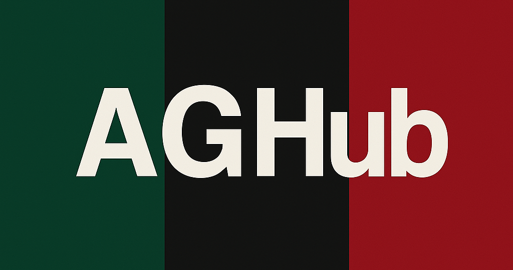

# IO_Hackathon
AGH IO 2025 Hackathon, Piotr Błaszczyk, Stanisław Barycki, Krzysztof Swędzioł, Joachim Grys, Eryk Olejarz, Piotr Rusak  
## Nazwa zespołu ##  
# Flippers   

## Nazwa aplikacji   
# AGHub    

# WIZJA PROJEKTU

## 1. Wstęp  

Dynamiczny charakter współczesnego życia studenckiego powoduje, że studenci często mają trudności ze zgraniem swoich harmonogramów, efektywnym planowaniem spotkań czy po prostu spędzaniem wspólnie czasu. Poszczególne wydziały oraz kierunki studiów często funkcjonują według różnych planów zajęć, co znacznie utrudnia organizację zarówno spotkań towarzyskich, jak i pracy grupowej.

Nasza aplikacja odpowiada na te problemy, dostarczając studentom scentralizowaną i intuicyjną platformę do łatwego planowania wydarzeń, koordynowania dostępności znajomych oraz sprawdzania ich planów zajęć w czasie rzeczywistym. Dzięki aplikacji użytkownicy mogą szybko zobaczyć, kiedy i gdzie ich znajomi mają zajęcia lub inne zobowiązania, co znacząco upraszcza organizowanie zarówno formalnych, jak i nieformalnych spotkań.

Rozwiązanie zostało stworzone z myślą o elastyczności i specyfice życia studenckiego, wspierając zarówno zaplanowane spotkania projektowe, jak i spontaniczne wydarzenia towarzyskie. Dzięki dostępowi przez przeglądarkę oraz urządzenia mobilne (systemy Adnroid oraz iOS), aplikacja nie tylko usprawnia współpracę między studentami, ale również wspiera budowanie silniejszych więzi społecznych w środowisku akademickim.

## 2. Grupa docelowa

Aplikacja jest skierowana przede wszystkim do studentów uczelni wyższych, niezależnie od kierunku czy roku studiów, którzy aktywnie angażują się w życie akademickie, realizują projekty grupowe lub po prostu chcą łatwiej organizować swój wolny czas z przyjaciółmi.

## 3. Opis produktu 

Aplikacja mobilna pozwala studentom łatwo planować i koordynować spotkania dzięki integracji z harmonogramami zajęć. Użytkownicy szybko sprawdzą dostępność znajomych oraz lokalizacje ich zajęć, mogą importować własne plany, zarządzać uczestnikami, deklarować obecność oraz wysyłać powiadomienia. Funkcja lokalizacji znajomych w czasie rzeczywistym usprawnia organizację zarówno formalnych, jak i spontanicznych spotkań.

## 4. Konkurencja

- niby google maps i lokalizacja na iphone ale w sumie to brak

## 5. główne funkcjonalności

- rejestracja i tym podobne
- dodawanie / szukanie znajomych
- importowanie planu zajęć
- wybiernie lokalizacji spotkania
- pokazywanie dostępności (dymek na teams czy zajety)
- wybieranie osób które zostną powiadomione / mogą wziąść udział
- szczgóły spotkania
- deklarowanie obecności
---

- kto w jakim budynku   
---

- (opcjoonalnie) udostępnianie swoje lokalizajci
- (ocpjonalnie) podgląd planów zajęć znajomych
- (opcjonalnie) kto w jakim budynku

## 6. Wymagania projektu 

- ma działąć na urządzęniach mobilnych 

## 7. Planowane technologie do użycia

- Sping Boot REST
- Hiberate
- React Native
- PostreSQL
- Docker
- gluestack